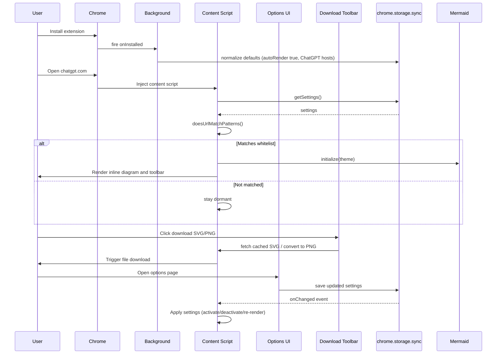

# Extension Flow

This guide outlines the user-visible lifecycle. For component responsibilities and deeper mechanics, see [`architecture.md`](./architecture.md).

## Lifecycle Overview

| Step | Trigger | Primary owner | Notes |
| --- | --- | --- | --- |
| Install or upgrade | Extension installed from source or Web Store | Background service worker | Seeds defaults and handles migrations (`architecture.md` → Runtime Components). |
| Host access granted | Chrome applies `manifest.ts` host permissions | Chrome / MV3 platform | Controls where the content script can run (`architecture.md` → Runtime Components). |
| Page activation | User opens a whitelisted URL | Content script | Fetches settings, checks URL against patterns, and, if allowed, initialises Mermaid (`architecture.md` → Data Flow Sequence). |
| Inline rendering | Mermaid blocks detected | Content script + Mermaid runtime | Injects managed containers, themes Mermaid, and caches SVG output (`architecture.md` → Mermaid Rendering & Downloads). |
| Settings changes | Options UI edits or resets settings | Options UI + shared settings utils | Saves updates through `saveSettings`; listeners reconcile state across surfaces (`architecture.md` → Settings Synchronisation). |
| Continuous updates | Chat adds new content or settings sync changes arrive | Content script | MutationObserver re-runs detection; storage listeners reapply activation rules (`architecture.md` → Settings Synchronisation). |

## Sequence Diagram

